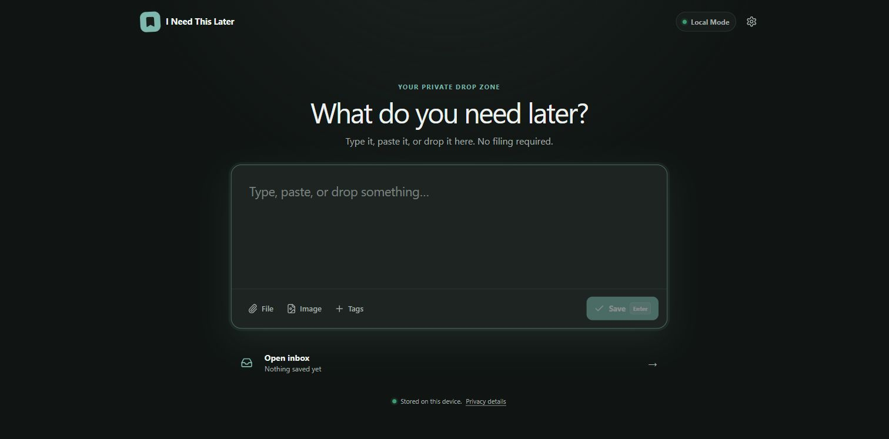

# I Need This Later

> “I don’t know where this belongs. I just know I’ll need it later.”

I Need This Later is a private, local-first inbox for links, notes, images, files, and the small pieces of context that are easy to lose. The first screen is always a focused capture box. Saving does not require an account, folder, content type, or network connection.



## Use or download

- **Web and iPhone/iPad:** open the [live PWA](https://jasermomm.github.io/need-this-later/). It can be installed from a supported browser and works offline after its application shell is cached.
- **Windows, macOS, Linux, and Android:** download the appropriate package from the [v1.0.0 release](https://github.com/jasermomm/need-this-later/releases/tag/v1.0.0). Windows and macOS desktop packages are unsigned; Android uses the project release key.
- **Browser extension:** download `need-this-later-extension.zip`, extract it, enable developer mode in a Chromium browser, and load the extracted directory as an unpacked extension.

The native desktop packages currently target Windows x64, macOS Apple silicon, and Linux x86-64. iPhone and iPad users should use the PWA; no iOS binary is distributed.

| Platform | Release download |
| --- | --- |
| Windows x64 | `.exe` setup or `.msi` installer |
| macOS Apple silicon | `.dmg` installer or `.app.tar.gz` archive |
| Linux x86-64 | `.AppImage`, `.deb`, or `.rpm` package |
| Android 6.0+ | `need-this-later-android.apk` |
| Chromium extension | `need-this-later-extension.zip` |

## What works

- Instant keyboard-first capture: `Enter` saves, `Shift + Enter` adds a line.
- Automatic link recognition, clipboard images, file picker, and desktop drag/drop.
- Encrypted IndexedDB storage with a non-exportable device key.
- Inbox, edit, copy, open, pin, archive, trash, restore, and undo delete.
- Fast local search across content, titles, URLs, domains, tags, filenames, and source context, including Arabic and Unicode.
- Optional tags and local reminders without organization pressure.
- Portable plaintext export and versioned password-encrypted backup/restore.
- Installable offline PWA and POST-based Web Share Target that does not put captured content in a URL.
- Optional end-to-end encrypted Supabase sync with recovery keys, conflict copies, tombstones, retries, and encrypted attachments.
- Chromium WebExtension with popup capture, selection capture, context menus, keyboard shortcut, extension-local encrypted storage, and optional encrypted vault upload.
- Tauri 2 desktop shell with tray behavior and a global quick-capture shortcut.
- Capacitor mobile shell plus Android and iOS native-share reference implementations.

There are no ads, trackers, analytics SDKs, background clipboard readers, or AI services.

## Privacy in one minute

Local Mode is the default. Items and attachments are encrypted before IndexedDB writes, and nothing is uploaded.

Sync Mode is optional. The client generates a random vault key, derives a wrapping key from the separate vault password with Argon2id, and encrypts records and attachments with XChaCha20-Poly1305 before upload. Supabase receives ciphertext plus the minimum metadata needed to route and reconcile changes. The operator cannot casually browse saved content, but can observe account identifiers, opaque record IDs, revisions, timestamps, object sizes, and access patterns.

This does not protect a user from a fully compromised operating system, a malicious browser extension with page access, or script execution inside the app origin. Read [SECURITY.md](SECURITY.md) and [the threat model](docs/THREAT_MODEL.md) before relying on the system for unusually sensitive material.

## Run locally

Requirements: Node.js 22.13 or newer.

```bash
npm ci
npm run dev
```

Open `http://localhost:3000`. Local Mode is immediately usable; Supabase is not required.

Quality gates:

```bash
npm run lint
npm run typecheck
npm test
npm run build
npm run build:pages
npm run build:extension
npm run verify:artifacts
```

## Platforms

| Surface | Location | Build |
| --- | --- | --- |
| Web / PWA | `app/`, `src/` | `npm run build:pages` |
| Sites worker | `app/`, `worker/` | `npm run build` |
| Browser extension | `apps/extension/` | `npm run build:extension` |
| Desktop | `apps/desktop/src-tauri/` | `npm run tauri -- build` |
| Mobile | `apps/mobile/` | Capacitor sync, then native platform build |
| Sync backend | `supabase/` | Supabase CLI migrations |

The static build uses the `/need-this-later/` base path for GitHub Pages. Set `BASE_PATH=./` when embedding it in Tauri or Capacitor.

## Repository map

```text
apps/          browser extension, desktop, and mobile shells
app/           shared React product interface
packages/      domain, crypto, database, search, backup, and sync logic
public/        PWA manifest and service worker
supabase/      local config, migrations, RLS, storage policies, and tests
tests/         crypto, storage, backup, search, and multi-device sync tests
docs/          architecture, security, build, sync, and hosting details
```

The web app and native shells share the data model and client-side security code. Platform wrappers do not implement a second item format.

## Self-host encrypted sync

See the beginner-friendly [Supabase self-hosting guide](docs/SELF_HOSTING.md). It has a no-terminal Dashboard walkthrough, a CLI workflow, local Docker instructions, verification steps, and troubleshooting. The app accepts a current public publishable key or a legacy `anon` key. Never put a secret or `service_role` key in a client build.

## Project documentation

- [Architecture](docs/ARCHITECTURE.md)
- [Encryption format](docs/ENCRYPTION.md)
- [Sync protocol](docs/SYNC.md)
- [Building every target](docs/BUILDING.md)
- [Self-hosting](docs/SELF_HOSTING.md)
- [Privacy policy](PRIVACY.md)
- [Security and disclosure](SECURITY.md)
- [Contributing](CONTRIBUTING.md)

## Windows code signing policy

Windows `v1.0.0` artifacts are currently unsigned. The project intends to use SignPath.io for future Windows code signing after approval.

When enabled, free code signing will be provided by SignPath.io, with a certificate from the SignPath Foundation.

### Roles

Committer, reviewer, and release approver:

- Jaser Mohamed (@jasermomm)

### Privacy

Need This Later is local-first. The application does not transfer
information to networked systems unless explicitly requested or enabled
by the user.

See the project's privacy and security documentation for additional details.

## License

MIT. See [LICENSE](LICENSE).
